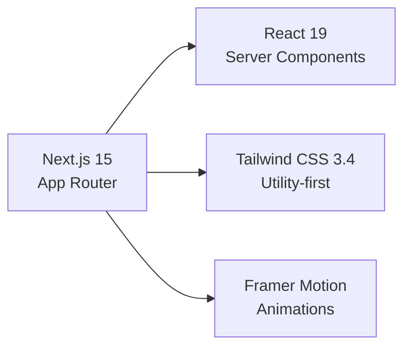

<div align="center">
  
  
  <h1 style="margin-top: 1rem; background: linear-gradient(135deg, #667eea 0%, #764ba2 100%); -webkit-background-clip: text; -webkit-text-fill-color: transparent; background-clip: text; font-size: 3rem; font-weight: 800;">
    Career Lens
  </h1>
  
  <p style="font-size: 1.25rem; color: #64748b; max-width: 600px; margin: 1rem auto; line-height: 1.6;">
    <strong>AI-Powered Career Guide Companion</strong> — Your intelligent partner for resume optimization, career coaching, job matching, and professional growth.
  </p>

  <div style="margin: 1.5rem 0;">
    
    
    
    
    
    
    
    
  </div>

  <div style="margin: 1.5rem 0;">
    <a href="#-quick-start" style="margin: 0 0.5rem; padding: 0.75rem 1.5rem; background: linear-gradient(135deg, #667eea 0%, #764ba2 100%); color: white; border-radius: 8px; text-decoration: none; font-weight: 600;">Quick Start</a>
    <a href="#-features" style="margin: 0 0.5rem; padding: 0.75rem 1.5rem; background: transparent; color: #667eea; border: 2px solid #667eea; border-radius: 8px; text-decoration: none; font-weight: 600;">Features</a>
    <a href="#-api-reference" style="margin: 0 0.5rem; padding: 0.75rem 1.5rem; background: transparent; color: #64748b; border: 2px solid #e2e8f0; border-radius: 8px; text-decoration: none; font-weight: 600;">API Docs</a>
    <a href="#-architecture" style="margin: 0 0.5rem; padding: 0.75rem 1.5rem; background: transparent; color: #64748b; border: 2px solid #e2e8f0; border-radius: 8px; text-decoration: none; font-weight: 600;">Architecture</a>
  </div>
</div>

---

## 📋 Table of Contents

<details open>
<summary><strong>Click to expand/collapse</strong></summary>

- [🎯 Overview](#-overview)
- [✨ Features](#-features)
- [🛠 Tech Stack](#-tech-stack)
- [🏗 Architecture](#-architecture)
- [🚀 Quick Start](#-quick-start)
- [⚙️ Configuration](#️-configuration)
- [📁 Project Structure](#-project-structure)
- [🔌 API Reference](#-api-reference)
- [🤖 AI Capabilities](#-ai-capabilities)
- [💳 Payment Integration](#-payment-integration)
- [🐳 Docker Deployment](#-docker-deployment)
- [🧪 Development](#-development)
- [🤝 Contributing](#-contributing)
- [📄 License](#-license)

</details>

---

## 🎯 Overview

**Career Lens** is a modern, AI-driven career platform built with **Next.js 15** (App Router) that empowers job seekers and professionals with intelligent tools for career advancement. The platform combines **Google's Generative AI** with a beautiful, responsive UI to deliver personalized career guidance at scale.

### Why Career Lens?

| Challenge | Career Lens Solution |
|-----------|---------------------|
| 📄 Generic resumes | AI-powered resume analysis & ATS optimization |
| 🎯 Unclear career path | Personalized AI career coach with contextual advice |
| 🔍 Job search fatigue | Intelligent job matching based on skills & preferences |
| ✍️ Poor resume writing | AI resume refinement with industry-specific keywords |
| 💰 Expensive career coaches | Affordable, 24/7 AI companion with premium tiers |

### Target Users
- **Job Seekers** — Fresh graduates to senior professionals
- **Career Switchers** — Transitioning between industries/roles
- **Recruiters** — Screening candidates with AI-assisted analysis
- **Universities** — Career services for students & alumni

---

## ✨ Features

<div align="center">

| Feature | Description | Status |
|---------|-------------|--------|
| 🔐 **Secure Authentication** | Firebase Auth with email/password, email verification, password reset | ✅ Live |
| 🤖 **AI Career Coach** | Conversational AI for career guidance, interview prep, skill gaps | ✅ Live |
| 📊 **Resume Analysis** | ATS scoring, keyword optimization, section-by-section feedback | ✅ Live |
| 🎯 **Job Matching** | Semantic matching against job descriptions with fit scoring | ✅ Live |
| ✨ **Resume Refinement** | AI rewriting with industry keywords, action verbs, quantifiable results | ✅ Live |
| 💳 **Premium Tiers** | Razorpay integration for subscription management | ✅ Live |
| 📱 **Responsive Dashboard** | Mobile-first design with Framer Motion animations | ✅ Live |
| 🌙 **Dark Mode Ready** | Tailwind CSS dark mode support (configurable) | 🚧 Planned |

</div>

### Feature Deep Dive

<details>
<summary><strong>🤖 AI Career Coach</strong> — Conversational career guidance</summary>

- **Context-aware conversations** — Remembers user profile, resume, and goals
- **Interview simulation** — Role-specific mock interviews with feedback
- **Skill gap analysis** — Identifies missing skills for target roles
- **Career roadmap generation** — Step-by-step progression plans
- **Powered by** Google Gemini 1.5 Flash / Pro via `@google/generative-ai`

</details>

<details>
<summary><strong>📊 Resume Analysis</strong> — ATS-optimized scoring</summary>

- **Overall ATS Score** (0-100) with breakdown
- **Keyword matching** against target job descriptions
- **Section analysis**: Summary, Experience, Education, Skills, Projects
- **Format validation** — PDF parsing, structure checking
- **Actionable recommendations** with priority levels

</details>

<details>
<summary><strong>🎯 Job Matching</strong> — Semantic job compatibility</summary>

- **Vector-based matching** using embeddings
- **Fit score calculation** (skills, experience, culture, location)
- **Gap highlighting** — Missing requirements visualization
- **Application readiness** checklist per job
- **Bulk analysis** for multiple job postings

</details>

<details>
<summary><strong>✨ Resume Refinement</strong> — AI-powered rewriting</summary>

- **Bullet point enhancement** — STAR method implementation
- **Keyword injection** — ATS-friendly terminology
- **Tone adjustment** — Professional, creative, technical, executive
- **Length optimization** — One-page vs. two-page formats
- **Version history** — Compare and revert changes

</details>

---

## 🛠 Tech Stack

### Core Framework


### AI & Data
| Category | Technology | Purpose |
|----------|------------|---------|
| **LLM** | Google Generative AI (Gemini) | Career coaching, resume analysis |
| **Embeddings** | Google AI Embeddings | Job matching, semantic search |
| **Parsing** | PDF.js / Custom | Resume text extraction |
| **Database** | Firebase Firestore | User data, sessions, history |

### UI & Components
| Library | Version | Usage |
|---------|---------|-------|
| **Radix UI** | Latest | Accessible primitives (Dropdown, Dialog, etc.) |
| **Lucide React** | Latest | Icon system |
| **React Hot Toast** | Latest | Notifications |
| **React Markdown** | Latest | AI response rendering |
| **class-variance-authority** | Latest | Component variants |
| **tailwind-merge** | Latest | ClassName merging |

### Infrastructure & Payments
| Service | Purpose |
|---------|---------|
| **Vercel** | Hosting, Edge Functions, Analytics |
| **Firebase Auth** | Authentication, user management |
| **Razorpay** | Subscription payments (INR) |
| **GitHub Actions** | CI/CD (configured) |

### Developer Experience
```json
{
  "linting": "ESLint 9 + Next.js config",
  "formatting": "Prettier (implied)",
  "compiler": "Babel React Compiler (experimental)",
  "css": "PostCSS + Tailwind CSS v4 (via @tailwindcss/postcss)",
  "types": "JSDoc + jsconfig.json (TypeScript-ready)"
}
```

---

## 🏗 Architecture

### High-Level System Design

```mermaid
graph TB
    subgraph Client["🌐 Client (Next.js App Router)"]
        A[Landing Page] --> B[Auth Pages]
        B --> C[Dashboard Layout]
        C --> D[Career Coach]
        C --> E[Resume Analysis]
        C --> F[Job Matching]
        C --> G[Profile & Billing]
    end

    subgraph API["⚡ API Routes (Edge Runtime)"]
        H[/api/ai-coach] --> I[Gemini API]
        J[/api/parse-resume] --> K[PDF Parser + Gemini]
        L[/api/resume-refine] --> I
        M[/api/jobs] --> N[Job Matching Engine]
        O[/api/create-order] --> P[Razorpay]
    end

    subgraph Services["☁️ External Services"]
        Q[Firebase Auth] --> R[Firestore DB]
        S[Google GenAI] --> T[Gemini 1.5 Flash
